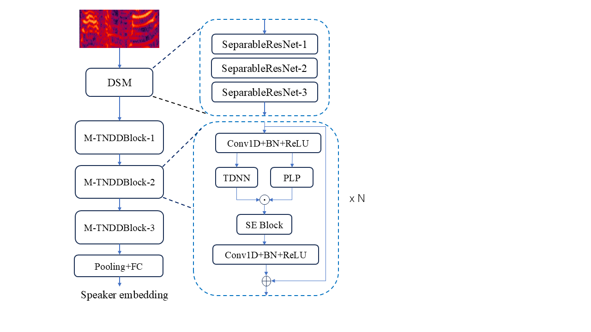

# MGFF-TDNN

MGFF-TDNN: A Multi-Granularity Feature Fusion TDNN Model with Depth-Wise Separable Module for Speaker Verification

## Model Architecture


we propose the MGFF-TDNN model, an enhanced TDNN-based architecture focused on multi-granularity context modeling. Firstly, to enhance the model's feature modeling in the frequency domain, a two-dimensional depthwise separable convolution module is employed as the front-end extractor to capture time-frequency domain features. Secondly, we devise a Multi-granularity Temporal Delay Neural Network (M-TDNN) module. Within M-TDNN, a phoneme-level local max-pooling module is integrated to enhance fine-grained feature modeling. Additionally, the dilation factor of the TDNN module is progressively increased to extend the temporal context for feature modeling. Subsequently, the outputs of these two components are concatenated and fed into an Squeeze-Excitation (SE) block to capture internal dependencies among multi-granularity features.

## Training Instructions  
This project is trained using the [3D-Speaker toolkit](https://github.com/modelscope/3D-Speaker/). To set up the training:  

1. **Copy Required Files**  
   - Place the training scripts from the `egs/voxceleb/` folder of this repository into the corresponding project directory in **3D-Speaker**.  
   - Copy the model files from the `speakerlab/models/` folder of this repository into the appropriate directory in **3D-Speaker**.  

2. **Configure Parameters**  
   Modify the parameters in the `egs/voxceleb/mgff_tdnn/run.sh` file to adapt to different phases of training and evaluation.  

3. **Run Training**  
   For detailed training workflows and additional configurations, refer to the official documentation of the **[3D-Speaker](https://github.com/modelscope/3D-Speaker/)** project.  

---

## Key Notes  
- Ensure compatibility between the toolkit version and the provided scripts/models.  
- Adjust paths in `run.sh` to match your local directory structure.  


## Training config
- Feature: 80-dim fbank, mean normalization, speed perturb
- Training: lr [0.0001, 0.1], batch_size 256, 1 gpu(NVIDIA RTX A6000), additive angular margin
- Metrics: EER(%), MinDCF

## Voxceleb Results
- Train set: Voxceleb2-dev, 5994 speakers
- Test set: Voxceleb1

|   Model   | Params | Voxceleb1-O <br/>EER(%) / MinDCF | Voxceleb1-E <br/>EER(%) / MinDCF | Voxceleb1-H <br/>EER(%) / MinDCF |
|:---------:|:------:|:--------------------------------:|:--------------------------------:|:--------------------------------:|
| MGFF-TDNN | 4.78M  |           0.89 / 0.086           |           1.05 / 0.119           |           1.91 / 0.195           |

## Acknowledge
This project builds upon the excellent work of the [3D-Speaker](https://github.com/modelscope/3D-Speaker/) project developed by Alibaba DAMO Academy. Their open-source implementation of speaker recognition models provided a solid foundation and valuable reference for our development.

## Citations
If you are using MGFF-TDNN model in your research, please cite: 
```BibTeX
@misc{li2025mgfftdnn,
      title={MGFF-TDNN: A Multi-Granularity Feature Fusion TDNN Model with Depth-Wise Separable Module for Speaker Verification}, 
      author={Ya Li and Bin Zhou and Bo Hu},
      year={2025},
      eprint={2505.03228},
      archivePrefix={arXiv},
      primaryClass={cs.SD},
      url={https://arxiv.org/abs/2505.03228}, 
}

```
